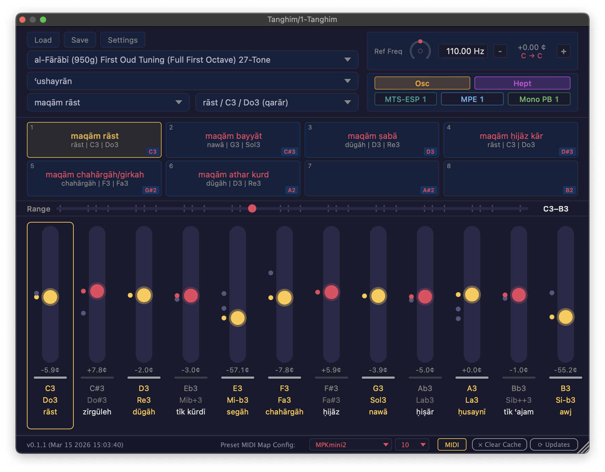

# Tanghīm

**Arabic Maqām tuning plugin for any DAW.**

Tanghīm is an open-source plugin that dynamically accesses tuning data from the [Digital Arabic Maqām Archive (DiArMaqAr) API](https://diarmaqar.netlify.app) and applies maqam-based tuning to your software and hardware instruments.

It is available as VST3, AU, and CLAP on macOS, Windows, and Linux. Internet access is needed only when selecting a tuning — once selected, the tuning system is saved in a cache on your local drive.

Three tuning methods — **MTS-ESP**, **MPE**, and **Mono Pitch Bend** — ensure compatibility with virtually any synthesizer. The project consists of two plugins:

- **Tanghīm** (Transmitter) — the main plugin with a full graphical interface. Broadcasts tuning via MTS-ESP and hosts a built-in reference oscillator.
- **Tanghīm Receiver** — a lightweight MIDI effect that reads the MTS-ESP tuning broadcast and delivers it to non-MTS-ESP instruments as MPE per-note pitch bend or mono 14-bit pitch bend.

Tanghīm was concieved and designed by [Khyam Allami](https://khyamallami.com) in 2026 as part of his postdoctoral research in the [Music Intelligence Lab](https://musicintelligencelab.com/) at the American University of Beirut, and coded with [Claude](https://claude.ai).



---

## Table of Contents

1. [Installation](#installation)
2. [Quick Start](#quick-start)
3. [Interface Overview](#interface-overview)
4. [Tuning Systems and Starting Note Names](#tuning-systems-and-starting-note-names)
5. [Maqam Selection](#maqam-selection)
6. [The Slider Bank](#the-slider-bank)
7. [Reference Frequency](#reference-frequency)
8. [Presets](#presets)
9. [MIDI Preset Mapping](#midi-preset-mapping)
10. [Tuning Methods](#tuning-methods)
11. [Utility Modes](#utility-modes)
12. [Tanghim Receiver](#tanghim-receiver)
13. [MIDI File Export](#midi-file-export)
14. [Save & Load State Files](#save-and-load-state-files)
15. [DAW Automation](#daw-automation)
16. [Using Tanghim in Ableton Live](#using-tanghim-in-ableton-live)
17. [Troubleshooting](#troubleshooting)

---

## Installation

Download the latest release for your platform from the [GitHub Releases page](https://github.com/KhyamAllami/tanghim/releases). Copy the two plugin files to the appropriate system directories for your operating system. After copying, rescan plugins in your DAW if they don't appear immediately.

You should have two plugins after installation:
- **Tanghim** (Transmitter) — `.vst3` / `.component` / `.clap`
- **Tanghim Receiver** — `.vst3` / `.component` / `.clap`

### macOS

| Format | Install Path |
|--------|-------------|
| VST3 | `~/Library/Audio/Plug-Ins/VST3/` |
| AU | `~/Library/Audio/Plug-Ins/Components/` |
| CLAP | `~/Library/Audio/Plug-Ins/CLAP/` |

On first launch, macOS may block the plugin. Right-click the `.vst3` bundle → **Open** to bypass Gatekeeper, or go to **System Settings → Privacy & Security** and click **Allow**.

### Windows

| Format | Install Path |
|--------|-------------|
| VST3 | `C:\Program Files\Common Files\VST3\` |
| CLAP | `C:\Program Files\Common Files\CLAP\` |

AU is not available on Windows.

### Linux

| Format | Install Path |
|--------|-------------|
| VST3 | `~/.vst3/` |
| CLAP | `~/.clap/` |

AU is not available on Linux. Some DAWs also check `/usr/lib/vst3/` and `/usr/lib/clap/` — consult your DAW's documentation if the plugin isn't detected.

### Data & Preferences

Tanghīm stores cached tuning data, settings, and exported MIDI files locally:

| | macOS | Windows | Linux |
|---|---|---|---|
| Settings | `~/Library/Tanghim/settings.json` | `%APPDATA%\Tanghim\settings.json` | `~/.config/Tanghim/settings.json` |
| Cache | `~/Library/Tanghim/cache/` | `%APPDATA%\Tanghim\cache\` | `~/.config/Tanghim/cache/` |
| MIDI export | `~/Library/Tanghim/midi-export/` | `%APPDATA%\Tanghim\midi-export\` | `~/.config/Tanghim/midi-export/` |

---

## Quick Start

1. **Load Tanghīm** on an instrument track in your DAW (it appears under Instruments / Tools).
2. **Choose a tuning system** from the dropdown at the top left (e.g. "Ibn Sīnā (1037) 7-Fret Oud 17-Tone").
3. **Choose a starting note name** from the dropdown next to it (e.g. "yegāh").
4. **Select a maqam** from the maqam selector dropdown.
5. **Play your MIDI keyboard.** Your instrument will receive the tuning via one of three methods depending on its capabilities — see [Tuning Methods](#tuning-methods).

---

## Interface Overview

The Tanghīm window is organized into three main areas:

### Top Bar
- **Tuning System Selector** (left) — choose the tuning system and starting note name
- **Reference Frequency Control** (center) — adjust the reference pitch
- **Mode Badges** (right) — status indicators for MTS-ESP, MPE, and Mono PB connections; clickable toggles for Oscillator and Heptatonic modes

### Middle Section
- **Maqam Selector** — searchable dropdown for maqam + variant/transposition
- **Preset Bar** — 8 preset slots for saving and recalling maqam configurations

### Slider Bank
- **12 chromatic pitch sliders** — fine-tune each pitch class with cent-accurate control
- **Range Scroller** — navigate the full MIDI range; magnetic snap to C, G, and A positions
- **Piano key indicators** — white/black key bars beneath each slider

### Status Bar (bottom)
- Version and build info (left)
- MIDI preset mapping controls, MIDI drag export, Clear Cache, and Update check (right)

---

## Tuning Systems and Starting Note Names

A tuning system (tanghīm) is an ordered sequence of pitch classes within an octave. The tuning system selector lets you browse all available systems from the DiArMaqAr API. You can check for updates to tuning system and maqamāt data at any time by clicking the **Update** button in the status bar.

Each tuning system has one or more **starting note names** — the name for the foundational pitch from which the tuning begins. Starting note names are not arbitrary transpositions; they reflect the historical and practical origins of each system:

- **Oud-based systems** (e.g. al-Kindī, al-Fārābī, Ibn Sīnā) typically start on **ʿushayrān**, reflecting oud tuning in perfect fourths
- **Monochord and sonometer systems** (e.g. Cairo Congress 1932) typically start on **yegāh** or **rāst**, reflecting theoretical measurement approaches

The starting note name matters because it determines the available maqāmāt, transposition possibilities, and modulation characteristics of the system. Changing the starting note name changes which maqamat are available and how they can be transposed — it is functionally the same as switching to a different tuning system entirely.

The plugin caches tuning data locally, so internet access is only needed the first time you select a particular tuning system and starting note name combination.

---

## Maqam Selection

The maqam selector is a two-part dropdown:

1. **Maqam name** — searchable list of all maqamat available in the selected tuning system
2. **Variant / Transposition** — when a maqam has multiple transpositions, a second dropdown appears. Each entry is labeled with the tonic's PAO name, IPN reference, and solfège — for example, `nawā / G3 / Sol3 (qarār)` for the base position, or `dūgāh / D3 / Re3` for a transposition

When a maqam is selected:
- The slider bank snaps to the maqam's interval pattern
- Degree highlights (gold) mark which sliders correspond to maqam degrees
- Slider labels update to show context-aware IPN names (e.g. "F#" in Hijaz vs "Gb" in Saba)
- The range scroller centers on the maqam's octave

---

## The Slider Bank

Each slider represents one chromatic pitch class and controls its tuning in cents deviation from 12-tone equal temperament.

### Snap Markers vs Free Tuning

Each slider has **snap markers** — small notches that indicate the tuning positions defined by the selected tuning system. When you select a maqam, the sliders snap to these positions automatically. However, snap markers are only a starting point. You are free to **drag any slider away from its marker** to adjust the tuning by ear. This is a core feature of Tanghīm — tuning systems in the database represent theoretical models, but in practice, performers constantly adjust intonation based on context, taste, and tradition. The sliders let you do exactly that: start from a theoretical tuning and refine it to match what sounds right to you.

When you move a slider away from its snapped position, the thumb turns **cyan** and the maqam name shows an asterisk (`*`) suffix, indicating the tuning has been modified from its theoretical values.

### Adjusting Tuning: All Octaves vs Single Octave

There are two ways to override the tuning of a pitch class:

**All octaves (drag)** — Drag a slider normally to adjust that pitch class across every octave at once. For example, dragging the D slider changes the tuning of every D on the keyboard (D2, D3, D4, etc.). This is the most common way to refine a tuning. Modified sliders show a **cyan** thumb (maqam degrees) or **teal** thumb (non-degree notes).

**Single octave (Shift+drag)** — Hold **Shift** and drag a slider to adjust the tuning of that note in only the current octave, leaving the same pitch class in all other octaves unchanged. This is useful when you need a note to be tuned differently in one register — for example, a slightly sharper segāh in a higher octave. Per-note overridden notes show a **blue** thumb glow.

### Other Controls

- **Variant selector** (click the note name) — some pitch classes have multiple tuning variants (e.g. different sizes of segāh). Click to cycle through them

### Range Scroller

The horizontal range bar below the sliders lets you pan across the full MIDI range:
- Drag to scroll
- Double-click to center on the maqam octave
- Magnetic snap to C, G, and A tick marks

---

## Reference Frequency

The reference frequency control adjusts the frequency of the tuning system's first pitch — for example, yegāh = 98 Hz or ʿushayrān = 110 Hz.

- **Arc knob** — drag to adjust (±700 cents range)
- **Hz input** — type an exact frequency; use up/down arrow keys for ±1 Hz nudges
- **Cents display** — shows the current offset in cents
- **Semitone buttons** (±) — shift by 100 cents
- **Transposition indicator** — shows the IPN shift (e.g. "C ↗ C#" or "G ↘ F#−")

The reference frequency persists relatively when switching tuning systems or starting note names. For example, if you select a tuning system with starting note name yegāh = 98 Hz and change it to 100 Hz, then switch the starting note name to ʿushayrān, it will use 112.25 Hz rather than reverting to its default of 110 Hz.

---

## Presets

The preset bar displays 8 slots (the plugin stores up to 16 internally). Each preset saves:
- The selected maqam and its degree positions
- All 12 slider cent offsets
- Optionally, the tuning system and starting note name (for modified presets)

### Using Presets
- **Save a preset** — select a maqam, then click an empty slot to save the current tuning state to it
- **Activate a preset** — click a saved preset to load it
- **Deactivate a preset** — click the active preset again to deactivate it (clears the maqam and resets sliders)
- **Delete a preset** — click the **x** on a saved preset to clear that slot
- **Map a preset to MIDI** — **Shift+click** a preset to enter MIDI learn mode (requires a MIDI device and channel to be selected first — see [MIDI Preset Mapping](#midi-preset-mapping))

### Modified Presets
If you adjust sliders after loading a maqam, the preset becomes "modified":
- The name shows an asterisk (`*`)
- Modified slider thumbs turn cyan
- The tuning system is stored with the preset so it can reload correctly

### Preset Storage

Presets are stored locally and shared across all DAWs — a preset saved in one DAW will be available in any other. To save and load different groups of presets along with all other settings (reference frequency, tuning system, etc.), use the Save/Load menu to export a `.tanghim` file (see [Save & Load State Files](#save-and-load-state-files)).

### Auto-Activation
When you select a maqam from the dropdown, the plugin automatically activates a matching unmodified preset if one exists.

---

## MIDI Preset Mapping

You can map MIDI notes to presets so you can switch between maqamat during performance using a MIDI controller.

### Setup
1. In the status bar, select your **MIDI input device** and **channel** from the dropdowns
2. **Shift+click** a preset slot to enter learn mode
3. Play the desired MIDI note on your controller
4. The note is now mapped — a badge appears on the preset showing the assigned note

### Clearing a Mapping
Click the note badge on a preset to remove the mapping.

### Important Notes
- MIDI preset mapping uses a **dedicated MIDI input** separate from your DAW's MIDI routing, ensuring reliable triggering regardless of DAW state
- MIDI notes on the preset mapping channel are filtered from the oscillator to prevent double-triggering
- Device and mapping settings are saved in `~/Library/Tanghim/settings.json`

---

## Tuning Methods

Tanghīm supports three methods for delivering maqam tuning to your instruments. The right choice depends on what your instrument supports. The top bar shows status badges for each active method (these are indicators, not toggles).

### MTS-ESP (Teal Badge)

MTS-ESP is an open protocol that broadcasts a 128-note frequency table. Instruments that support MTS-ESP retune themselves automatically — no Receiver plugin needed.

- **Best for:** Software synths with built-in MTS-ESP support
- **How it works:** Tanghīm broadcasts tuning data via shared memory. Any MTS-ESP-compatible instrument running on the same machine picks it up instantly
- **Compatible instruments include:** Surge XT, Vital, Diva (enable MTS-ESP in settings), Pianoteq, ZynAddSubFX, and many others
- **Setup:** Just load Tanghīm and your instrument — the connection is automatic

### MPE — MIDI Polyphonic Expression (Blue Badge)

MPE delivers tuning as per-note pitch bend messages across MIDI channels 2–16. Each note gets its own channel, allowing polyphonic tuning with independent pitch bend per voice.

- **Best for:** Polyphonic instruments that support MPE but not MTS-ESP, including many hardware synths and some software instruments
- **How it works:** The Tanghīm Receiver plugin sits before your instrument in the signal chain and converts the MTS-ESP tuning into MPE pitch bend messages
- **Default pitch bend range:** 48 semitones (set this to match your instrument's MPE pitch bend range)
- **Setup:** Load Tanghīm Receiver before your instrument and select MPE mode

### Mono Pitch Bend (Green Badge)

Mono Pitch Bend delivers tuning as 14-bit pitch bend on a single MIDI channel. This is the most universally compatible method — nearly every synth responds to pitch bend.

- **Best for:** Monophonic patches, instruments without MPE support, hardware synths, and any instrument that only responds to standard pitch bend
- **How it works:** The Tanghīm Receiver calculates the required pitch bend for each note and sends it on the same channel. Includes a note stack with last-note priority for legato playing
- **Default pitch bend range:** 2 semitones (set this to match your instrument's pitch bend range)
- **Setup:** Load Tanghīm Receiver before your instrument and select Mono PB mode

### Which Method Should I Use

| Your Instrument | Recommended Method |
|---|---|
| Software synth with MTS-ESP support (Surge XT, Vital, Pianoteq, etc.) | **MTS-ESP** — zero setup, polyphonic, highest precision |
| Software synth with MPE support but no MTS-ESP | **MPE** — polyphonic tuning via Receiver |
| Hardware synth with MPE support | **MPE** — polyphonic tuning via Receiver |
| Hardware synth (standard MIDI only) | **Mono PB** — works with any pitch-bend-capable instrument |
| Monophonic synth or mono patch | **Mono PB** — simplest, most compatible |
| Instrument with no pitch bend at all | **MTS-ESP** is the only option (if supported) |

You can use multiple methods simultaneously — for example, MTS-ESP for your main synths and a Receiver in Mono PB mode for a hardware synth, all driven by the same Tanghīm instance.

---

## Utility Modes

In addition to the tuning delivery methods above, Tanghīm has two utility modes. Unlike the tuning method badges (which are status indicators), these are **clickable toggles** in the top bar.

### Osc — Internal Oscillator (Amber Badge)

Click the **Osc** badge to enable a built-in 16-voice polyphonic triangle wave synthesizer. This lets you hear and audition tunings directly from the plugin without needing any external instrument loaded. The oscillator responds to MIDI input just like a regular synth — play notes and you'll hear the current tuning immediately.

The oscillator runs alongside the tuning output, so you can use it at the same time as your other instruments. It's particularly useful for:
- Quickly previewing how a maqam or tuning system sounds before setting up instruments
- Verifying tuning adjustments in real time as you move sliders
- Teaching and demonstration purposes

### Hept — Heptatonic Keyboard Mode (Magenta Badge)

Click the **Hept** badge to remap your MIDI keyboard so that the **white keys play the maqam degrees** in order, starting from the tonic's natural key position. Black keys retain their standard chromatic pitch. This mode is only available when a maqam is selected.

Most maqamat are heptatonic (7-note) scales, but on a standard 12-key chromatic keyboard, the scale degrees often fall on a mix of white and black keys depending on the tonic. Heptatonic mode eliminates this problem — no matter what the tonic is, you can play the full maqam scale using just the white keys, making it much easier to play melodies without memorizing which black keys are part of the scale.

Heptatonic mode affects all tuning delivery methods (MTS-ESP, MPE, and Mono PB) simultaneously.

---

## Tanghim Receiver

The Receiver is a lightweight MIDI effect plugin that enables MPE and Mono Pitch Bend tuning delivery. It reads the MTS-ESP tuning broadcast from Tanghīm and converts it to pitch bend messages that any instrument can understand. See [Tuning Methods](#tuning-methods) for details on when to use MPE vs Mono PB.

### Setup
1. Load **Tanghīm** on one track (the transmitter)
2. Load **Tanghīm Receiver** before each instrument that needs pitch-bend-based tuning
3. Choose **MPE** or **Mono PB** mode depending on your instrument (see the [comparison table](#which-method-should-i-use))
4. Set the Receiver's pitch bend range to match your instrument's pitch bend range setting
5. The Receiver automatically connects to the Transmitter — the status display shows the active tuning system

You can run multiple Receiver instances simultaneously, each in a different mode for different instruments.

**Note:** Ableton Live does not support VST3 MIDI effect plugins, so the Receiver cannot be loaded directly in Ableton. A Max for Live device is provided instead — see [Using Tanghim in Ableton Live](#using-tanghim-in-ableton-live) for details.

### Pitch Bend Combining
If the player sends pitch bend wheel messages, the Receiver combines them with the tuning bend. This means your pitch wheel works normally on top of the maqam tuning.

---

## MIDI File Export

You can export the current maqam scale as a Standard MIDI File for use in other applications.

- Click the **MIDI drag button** in the status bar
- Drag it into your DAW or file manager
- The file is saved to `~/Library/Tanghim/midi-export/`
- Filename format: `maqamname_(PAOname-IPN-solfege).mid`

The exported file contains all scale degrees played simultaneously as a chord (SMF Type 0, one quarter note).

---

## Save and Load State Files

Tanghīm can save and load its complete state as `.tanghim` files — human-readable JSON that captures your tuning system, maqam, slider positions, presets, and reference frequency.

- **Save**: File → Save (or use the menu/bridge command) to export a `.tanghim` file
- **Load**: File → Load to restore a saved state

This is useful for sharing tuning configurations or backing up your setup outside of DAW project files.

---

## DAW Automation

Tanghīm exposes its key tuning parameters to your DAW's automation system. You can draw automation curves, map MIDI CC, or use any DAW automation feature to control these parameters in real time.

### Automatable Parameters

| Parameter | Range | Description |
|---|---|---|
| `Slider 1` – `Slider 12` | ±150 cents | Cents deviation for each of the 12 chromatic pitch classes. Slider 1 = C, Slider 2 = C#, etc. |
| `Ref Freq` | ±700 cents | Reference frequency offset from the tuning system's default |
| `Preset` | None, 1–8 | Active preset index. Automate this to switch between saved maqam presets at specific points in your arrangement |

### Usage Tips

- **Automating sliders** (`Slider 1`–`Slider 12`) lets you smoothly glide tuning between positions — useful for creative effects or gradual intonation shifts during a performance
- **Automating the preset parameter** is a simple way to switch between maqamat at defined points in a song without MIDI preset mapping
- **Automating the reference frequency** lets you create pitch drifts or transpose the entire tuning smoothly over time
- All automation updates are applied at audio-rate for glitch-free transitions
- Automation and manual slider adjustments coexist — the last value written (whether from automation or the UI) takes effect

### MIDI CC Mapping

Most DAWs allow you to map MIDI CC messages to plugin parameters. This means you can control any of the above parameters from a hardware MIDI controller's knobs or faders. Consult your DAW's documentation for how to set up MIDI CC → parameter mapping (sometimes called "MIDI Learn" on the DAW side — this is separate from Tanghīm's own MIDI preset mapping feature).

---

## Using Tanghim in Ableton Live

Ableton Live has some specific requirements and limitations that affect how Tanghīm works. This section covers everything you need to know.

### Why Ableton Needs Special Handling

Ableton Live **does not support VST3 MIDI effects**. This means the Tanghīm Receiver plugin (which is a MIDI effect) cannot be loaded directly in Ableton as it can in other DAWs. Additionally, Ableton **merges all MIDI to channel 1** between tracks, which breaks MPE routing between tracks.

To work around these limitations, Tanghīm provides a **Max for Live Receiver** device that replicates the Receiver's MPE and Mono Pitch Bend functionality within Ableton's MIDI effect framework.

### Setup with MTS-ESP

If your instrument supports MTS-ESP, this is the simplest path — no Receiver or M4L device needed.

1. Create a new **MIDI track**
2. Load **Tanghīm** as an instrument on that track
3. On any other instrument track, load an MTS-ESP-compatible synth (e.g. Surge XT, Vital)
4. The synth will automatically receive the tuning broadcast

### Setup with Max for Live Receiver (MPE or Mono Pitch Bend)

For instruments that don't support MTS-ESP — including hardware synths and many software instruments — the Max for Live Receiver delivers tuning via MPE or Mono Pitch Bend, just like the standalone Receiver plugin.

#### Installing the Max for Live Device

1. Locate the `Tanghim Receiver.maxpat` file in the `m4l/` folder of the project
2. Copy the entire `Tanghim/` folder (containing the `.maxpat` and supporting files) to:
   ```
   ~/Music/Ableton/User Library/Presets/MIDI Effects/Max MIDI Effect/Tanghim/
   ```
3. The Tanghīm Receiver VST3 plugin must also be installed (the M4L device loads it internally)
4. Restart Ableton Live

#### Using the Max for Live Receiver

1. Load the main **Tanghīm** plugin on one MIDI track
2. On your instrument track, add the **Tanghīm Receiver** Max for Live MIDI effect *before* your instrument
3. Choose **MPE** or **Mono PB** mode depending on your instrument (see the [comparison table](#which-method-should-i-use))
4. Set the pitch bend range in the M4L device to match your instrument's setting
5. Play — the M4L device reads the MTS-ESP tuning and applies pitch bend to each note

#### How the M4L Device Works

The Max for Live wrapper uses a two-part architecture:
- A hidden VST3 instance of Tanghīm Receiver acts as a data bridge, polling the MTS-ESP tuning table
- A Max `js` object handles the actual MIDI processing (pitch bend calculation and channel allocation)

This design is necessary because Ableton doesn't allow VST3 plugins to process MIDI directly as effects.

### Ableton-Specific Notes

- **Computer MIDI Keyboard timing**: When the Tanghīm plugin window is focused, Ableton's built-in computer keyboard MIDI input may have slightly delayed timing. This is a known macOS WebView issue. **Workaround**: click outside the plugin window, or use an external MIDI controller (which is unaffected).
- **Plugin scanning**: On Apple Silicon Macs, Ableton's plugin scanner runs under Rosetta (x86_64). The plugin is built as a universal binary to ensure compatibility.
- **MIDI routing between tracks**: Ableton normalizes MIDI to channel 1 between tracks. This is why the standalone Receiver VST3 cannot be used in Ableton — you must use the M4L Receiver device for MPE and Mono PB delivery, or use MTS-ESP directly.

---

## Troubleshooting

### Plugin doesn't appear in DAW
- Verify the plugin files are in the correct directory for your OS (see [Installation](#installation))
- Rescan plugins in your DAW's preferences
- On macOS, you may need to bypass Gatekeeper (see [macOS installation notes](#macos))

### MTS-ESP not connecting
- Ensure only **one** Tanghīm transmitter instance is running. Multiple transmitters will conflict
- Check that your instrument has MTS-ESP support enabled in its settings
- Check that the MTS-ESP badge (teal) is lit in the top bar, confirming the transmitter is active

### Plugin crashes in Ableton (SIGKILL / Code Signature Invalid)
If you're building from source: when reinstalling the plugin, you must **delete** the old `.vst3` bundle before copying the new one. Overwriting corrupts macOS's kernel code signature cache, causing Ableton's Rosetta plugin scanner to kill the plugin. Always:
```bash
rm -rf ~/Library/Audio/Plug-Ins/VST3/Tanghim.vst3
# then copy the new build
```

### No sound from internal oscillator
- Click the Osc badge (amber) in the top bar to make sure it's enabled
- Check that MIDI is reaching the plugin (the slider bank shows gold thumb glows on active notes)
- The oscillator is quiet by design (−18 dBFS) — check your output volume

### Stale tuning data
Click **Clear Cache** in the status bar to force a fresh fetch from the DiArMaqAr API on next load. You can also click the **Update** button to check for new tuning system and maqamāt data.

### MIDI preset device not responding
- Check that the correct MIDI input device and channel are selected in the status bar
- If the device was disconnected and reconnected, the plugin should auto-detect it. If not, reselect it from the dropdown

---

## Credits

Conceived and designed by [Khyam Allami](https://khyamallami.com) at the [Music Intelligence Lab](https://musicintelligencelab.com/), American University of Beirut. Coded with [Claude](https://claude.ai).

Accesses tuning data via the [Digital Arabic Maqām Archive (DiArMaqAr) API](https://diarmaqar.netlify.app) and broadcasts tuning via the [MTS-ESP](https://github.com/ODDSound/MTS-ESP) protocol.

Built with [JUCE 8](https://juce.com/) and React/TypeScript.
